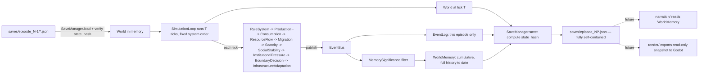
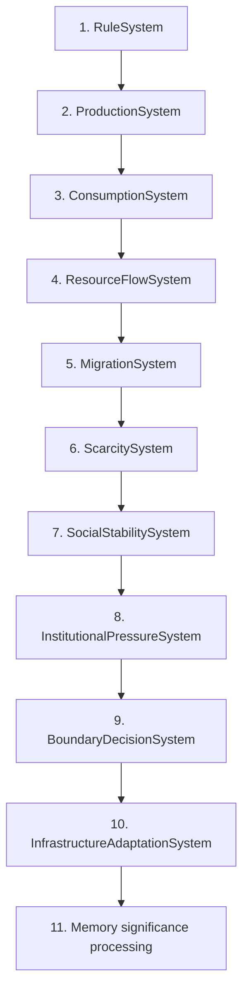

# Living Diorama Engine — Architecture Document v1.2

**Change from v1.1:**
1. `RuleSystem` moves from the end of the per-tick order to the **beginning**. A scheduled law change at tick T must affect all causal systems during tick T, not begin indirectly at tick T+1.
2. A new domain invariant is codified: **`RuleSystem` may mutate `Law` state only.** It must never create, delete, deactivate, decay, or otherwise modify any `Wall`, `Boundary`, `Infrastructure`, `District`, or `ResourcePool`. Wall persistence through a law restoration is therefore guaranteed by construction, not by system-order luck.
3. A Post-MVP Architecture Decision for memory compaction is added (§13). No compaction is implemented in the MVP.

All other content from v1.2's predecessor is unchanged and carried forward: district-level aggregate MVP scope, entity model, folder structure, save schema, Clean Architecture boundaries, and deterministic RNG discipline.

---

## 1. Folder Structure

*(unchanged from v1.1)*

```
living_diorama_engine/
├── engine/
│   ├── config/
│   │   └── engine_config.py
│   └── clock.py
│
├── entities/
│   ├── base_entity.py
│   ├── district.py
│   ├── boundary.py
│   ├── wall.py
│   ├── law.py
│   ├── resource_pool.py
│   └── infrastructure.py
│
├── systems/
│   ├── base_system.py
│   ├── rule_system.py
│   ├── production_system.py
│   ├── consumption_system.py
│   ├── resource_flow_system.py
│   ├── migration_system.py
│   ├── scarcity_system.py
│   ├── social_stability_system.py
│   ├── institutional_pressure_system.py
│   ├── boundary_decision_system.py
│   └── infrastructure_adaptation_system.py
│
├── events/
│   ├── event.py
│   ├── event_bus.py
│   └── event_log.py
│
├── memory/
│   ├── world_memory.py
│   ├── memory_significance.py
│   └── memory_query.py
│
├── simulation/
│   ├── world.py
│   ├── simulation_loop.py
│   └── rng.py
│
├── persistence/
│   ├── save_manager.py
│   ├── schema/
│   │   ├── world_schema_v1.py
│   │   ├── migrations.py
│   │   └── state_hash.py
│   └── serializers/
│       ├── district_serializer.py
│       ├── boundary_serializer.py
│       ├── wall_serializer.py
│       ├── law_serializer.py
│       ├── event_serializer.py
│       └── world_serializer.py
│
├── render/
│   └── export/
│       └── godot_export.py
│
├── narration/
│
├── cli/
│   └── run_episode.py
│
├── tests/
│   ├── entities/
│   ├── systems/
│   ├── events/
│   ├── memory/
│   ├── persistence/
│   └── simulation/
│
├── saves/
│   ├── episode_000/
│   │   ├── manifest.json
│   │   ├── world_state.json
│   │   ├── event_log.json
│   │   └── world_memory.json
│   └── episode_001/ ...
│
├── docs/
│   ├── architecture.md
│   ├── save_format.md
│   └── episode_log.md
│
├── pyproject.toml
└── README.md
```

(`systems/` listing reordered to show `rule_system.py` first, matching its new position in the runtime pipeline — file layout has no import-order meaning in Python, but the listing order now documents the tick order at a glance.)

---

## 2. Module Responsibilities

*(unchanged from v1.1)*

| Module | Responsibility | Does NOT do |
|---|---|---|
| `entities` | Pure data: District, Boundary, Wall, Law, ResourcePool, Infrastructure. | No behavior, no I/O, no simulation logic |
| `systems` | Behavior. Each system reads `World`, mutates state, publishes events. One causal concern per system. | No persistence, no direct file access, no calling other systems |
| `events` | Vocabulary of "what happened," this episode only. | No interpretation of significance |
| `memory` | Filters events into durable, cumulative facts. | Doesn't decide what happens |
| `simulation` | Orchestration. Owns `World` and the tick loop, in the fixed order from §7. | No serialization, no rendering |
| `persistence` | Converts World/EventLog/WorldMemory ⇄ JSON. Owns schema versioning and state-hash lineage. | No simulation logic |
| `render` | Stub in MVP. | Never mutates the world |
| `narration` | Not built yet. | Never runs inside the simulation loop |
| `cli` | Composition root. | No business logic of its own |

---

## 3. Entity / Class Diagram

*(unchanged from v1.1 — District, Boundary, Wall, Law, ResourcePool, Infrastructure, World, System hierarchy, SimulationLoop, EventBus, EventLog, WorldMemory, SaveManager. See v1.1 for the full Mermaid diagram; no class shape changed in this revision.)*

**New annotation on `RuleSystem`:** its `update(world, bus)` contract is now explicitly scoped — it reads and writes `World.laws` only. This is a responsibility-contract statement, enforced by convention and by the dedicated invariant test in §10, not by a language-level access restriction (Python doesn't have one to lean on here; the boundary is architectural, not a compiler guarantee).

---

## 4. Data Flow



Note the change from v1.1: `RuleSystem` is no longer a pre-loop, episode-level step drawn before `SimulationLoop` begins — it is now the **first system inside every tick**, so a law scheduled to change at tick 1820 is applied before `ProductionSystem` runs at tick 1820, and the entire causal chain that tick already sees the new law state.

---

## 5. Save Schema

*(unchanged from v1.1 — `manifest.json` with `state_hash`/`parent_state_hash`, `world_state.json`, episode-scoped `event_log.json`, cumulative `world_memory.json`. See v1.1 for full examples; no field changed in this revision.)*

---

## 6. Event and Memory Pipeline

*(unchanged from v1.1.)* One clarification given the reorder: because `RuleSystem` now runs first, a `LAW_RESTORED` event is published **before** that tick's `BoundaryDecisionSystem`/`InfrastructureAdaptationSystem` run — so `MemorySignificance` (still last, step 11) sees both the law-restoration event and that tick's fresh wall/infrastructure state when deciding whether to record a `LAW_RESTORED_WALL_PERSISTED` fact. This is strictly better than v1.1's ordering for narrative accuracy: the fact can now correctly state "the wall was already standing when the law was restored this tick," rather than describing a lagged reaction.

---

## 7. Simulation System Order — RuleSystem-First Correction



**Why RuleSystem moved to position 1:**

In v1.1, `RuleSystem` ran last (position 10 of 11), reasoned as "law changes are recorded after the causal chain resolves." That reasoning was wrong for a specific case: if a law is scheduled to change *at* tick T, running `RuleSystem` after `ResourceFlowSystem` etc. means those systems at tick T still see the *old* law value — the change doesn't actually take effect until tick T+1. That's a one-tick lag between "the episode's script says the law changed here" and "the world actually reacted here," which is a causally wrong artifact, not a deliberate design choice.

Running `RuleSystem` first fixes this: `World.laws` is updated to this tick's authoritative state before anything else runs, so `ResourceFlowSystem`, `BoundaryDecisionSystem`, and every other system at tick T always act on tick T's true law state. The scar's causal story — "the law changed here, and here is what districts did about it, in the same tick" — is now exact.

**The new invariant this requires:**

> **`RuleSystem` may mutate `Law` state only.** It must never create, delete, deactivate, decay, or otherwise modify any `Wall`, `Boundary`, `Infrastructure`, `District`, or `ResourcePool`, directly or indirectly.

Running first makes this invariant *necessary*, not just tidy: if `RuleSystem` could touch `Wall` state, running it before `BoundaryDecisionSystem` and `InfrastructureAdaptationSystem` would let a law restoration reach into a wall's fields before the very systems responsible for wall persistence get a say — reintroducing, through a back door, the exact bug this whole correction exists to prevent ("restoring the law erases the wall").

By restricting `RuleSystem` to `Law` only, wall persistence becomes **structurally guaranteed** rather than an accident of ordering: there is no code path, at any position in the tick, through which restoring a law can touch a `Wall`. Only `BoundaryDecisionSystem` (position 9) writes `Wall` state, and its own logic — not `RuleSystem`'s — is what would have to change for a wall to ever be removed.

**Steps 2–10 causal chain (unchanged reasoning from v1.1, renumbered):**

2. **ProductionSystem** — districts generate resources, now against this tick's already-current law state.
3. **ConsumptionSystem** — population draws down resources.
4. **ResourceFlowSystem** — surplus/deficit districts exchange resources across boundaries, gated by whether the movement/resource-sharing law is active *this tick* — correctly, because `RuleSystem` already ran.
5. **MigrationSystem** — population shifts in response to the resource picture flow just produced.
6. **ScarcitySystem** — computes each district's `scarcity` from final population/stock/rates.
7. **SocialStabilitySystem** — derives `fear`/`trust` from `scarcity`.
8. **InstitutionalPressureSystem** — derives `institutional_pressure` from fear/trust/scarcity.
9. **BoundaryDecisionSystem** — the *only* system permitted to build, strengthen, or (in principle) challenge a wall, based on sustained pressure over time.
10. **InfrastructureAdaptationSystem** — infrastructure dependency grows only once a wall exists and stays active.
11. **Memory significance processing** — runs last, after every mutation and event for the tick exists.

**Determinism constraints (unchanged from v1.1):**
- Systems never call each other directly — each only reads/writes `World` and publishes to `EventBus`. `SimulationLoop` is the only thing that knows the order.
- Any system using randomness draws from `World.rng` in a fixed, single-consumption-order per tick.

---

## 8. Dependency Graph

*(unchanged from v1.1 — reordering systems internally doesn't change module-level dependency direction. `systems/` still depends only on `entities/` and `events/`; `entities/` still has zero in-project dependencies.)*

---

## 9. Development Roadmap

*(unchanged in phase structure from v1.1, with one clarifying note added to Phase 11.)*

| Phase | Deliverable | Exit Criteria |
|---|---|---|
| 0 | Repo scaffold | `pytest` runs green on nothing |
| 1 | `entities/` — District, Boundary, Wall, Law, ResourcePool, Infrastructure | All constructible, fully typed, unit-tested, no behavior |
| 2 | `simulation/rng.py` + `events/` | Same seed → same event sequence |
| 3 | `simulation/world.py` + `simulation_loop.py` | Loop runs N empty ticks against a 4-district World with zero systems |
| 4 | `ProductionSystem`, `ConsumptionSystem`, `ResourceFlowSystem` | Resources move/deplete deterministically, tested with `Law` state held fixed |
| 5 | `MigrationSystem`, `ScarcitySystem` | Scarcity responds correctly to pressure |
| 6 | `SocialStabilitySystem`, `InstitutionalPressureSystem` | Fear/trust/pressure derive correctly |
| 7 | `BoundaryDecisionSystem` | Wall builds only under sustained pressure, positive and negative tests pass |
| 8 | `InfrastructureAdaptationSystem` | `dependency_score` climbs while a wall is active |
| 9 | `persistence/` — SaveManager, schema v1, state_hash | Save → load → identical World, hash matches |
| 10 | `memory/` — MemorySignificance + cumulative WorldMemory | Wall-built and law-restored events become durable facts |
| 11 | `rule_system.py` — one-law-per-episode mechanic, **wired in at position 1 of the tick order** | A law can be deactivated and later restored, same-tick effect proven, and the write-scope invariant (Law only) proven by test |
| 12 | `cli/run_episode.py` — full multi-episode continuation | Episode N+1 loads episode N's save, verifies `state_hash`, applies the next rule, runs |
| — | **MVP complete** | Full vertical slice in §10 passes, across multiple seeds |
| Post-MVP | Citizen-level simulation, memory compaction (§13) | Not started until MVP vertical slice is proven |

Phase 4–8 are still built and tested with `Law` state held fixed, before `RuleSystem` itself is implemented in Phase 11 — this keeps early phases simple even though, once wired together, `RuleSystem` executes *first* at runtime. Build order and runtime order are independent decisions.

---

## 10. MVP Acceptance Tests

*(Tests 1, 2, 4–6, 8–11 unchanged from v1.1. Tests 3 and 7 updated; two new tests added for this correction.)*

1. **Baseline load** — a 4-district world with a functioning movement/resource-sharing law loads without error.
2. **Baseline stability** — running the baseline for T ticks with no rule change keeps scarcity/fear/trust/pressure within a stable band.
3. **Law removed → same-tick reaction** *(updated)* — deactivating the movement/resource-sharing law at tick T causes `ResourceFlowSystem`'s behavior to change starting at tick T itself, not tick T+1. Verified by comparing `ResourceFlowSystem`'s output at tick T against a control run where the law stays active.
4. **Wall requires sustained conditions (positive)** — a wall builds only after prolonged high institutional_pressure.
5. **Wall requires sustained conditions (negative)** — a short transient spike does not produce a wall.
6. **Infrastructure dependency grows** — while a wall is active, connected infrastructure's `dependency_score` increases; unconnected infrastructure's does not.
7. **Law restored, wall persists** *(updated)* — restoring the law flips `Law.active`/`current_value` in the same tick the restoration is scheduled; `Wall.permanent` remains `true` and the wall is not removed from `World.walls`.
8. **`RuleSystem` write-scope invariant** *(new)* — snapshot `World` immediately before and after a tick containing a `RuleSystem` update; diff every non-`Law` entity. The diff must be empty. This is a direct, automated proof of the §7 invariant, not just a code-review convention.
9. **RuleSystem-first ordering** *(new)* — a law scheduled to change at tick T is confirmed active/inactive in `World.laws` before `ProductionSystem.update()` is called at tick T, verified via event ordering within the tick's published events.
10. **Episode saved immutably** — the run produces a new `saves/episode_N/` folder; no prior episode folder is modified.
11. **Reload fidelity** — loading `episode_N` reproduces the exact wall, dependency scores, and law state saved, including `state_hash` verification.
12. **Self-contained reload** — `episode_N`'s `world_memory.json` is fully queryable without reading earlier episode folders.
13. **Cross-seed variance** — the same scenario across distinct seeds produces some runs with zero walls, some with one, some with multiple.

---

## 11. Post-MVP Deferred Features

*(unchanged from v1.1 — Citizen entity, Relationships, individual MortalitySystem, ReproductionSystem, per-citizen memory, render/Godot export, Blender integration, UI, networking, LLM narration calls. Architectural seam for `Citizen` unchanged: addable later without modifying `District`, `Wall`, `Law`, or any existing file.)*

---

## 12. Architecture Decision Record: Aggregate District Simulation Before Individual Citizens

*(unchanged from v1.1 — see that document for the full ADR. Status: Accepted.)*

---

## 13. Post-MVP Architecture Decision: Memory Compaction

**Status:** Deferred — documented now, not implemented in the MVP.

**Context:** `world_memory.json` is fully cumulative by design (§5, §6) so every episode folder reloads standalone. Across hundreds of episodes this file grows monotonically. The MVP explicitly does not solve this — it is accepted as out of scope until the district-level vertical slice is proven — but the future shape of the solution is recorded now so later work doesn't have to re-derive it.

**Decision (for a future, not-yet-scheduled phase):**
- Canonical historical facts are never deleted.
- Once a configurable threshold is reached, older facts may be moved into immutable, hashed archive chunks.
- The active memory file may retain a compact index and high-level summaries in place of the archived raw facts.
- Every summary must remain traceable to canonical fact IDs, so no historical detail is ever silently unrecoverable.
- No compaction work starts before the district-level MVP is proven.

**Consequences:** The MVP will accumulate an unbounded `world_memory.json` per latest episode. This is an accepted, explicit tradeoff — not an oversight — and is bounded by the fact that MVP acceptance (§10) only requires proving the mechanic across a bounded test run, not hundreds of real episodes back-to-back.

---

*No implementation code included per instructions. This document supersedes v1.1's system order (§7), data flow (§4), and roadmap/acceptance-test details affected by the RuleSystem correction; all other v1.1 content — entity model, save schema, dependency graph, Post-MVP deferral list, and the district-first ADR — is unchanged and carried forward.*
